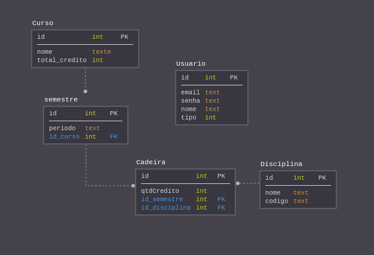

# ProjetoNati - API
> Api para gerência de matriz curricular.

# Suposições realizadas
 atutenticação é feita por email e senha.
 
 As relações Suposta entre entidades são: 
    <ul>
    <li>Curso possui muito semestres</li>
    <li>Semestre possui um curso e muitas cadeiras</li>
    <li>Cadeira possui um semestre e uma disciplina</li>
    <li>Disciplina possui muitas cadeiras</li>
    <li>A entidade Usuario não possui relacionamentos</li>
    </ul>

# Esquema do banco



# Json e Rotas

<h3>Usuario</h3>

<h4>Post http://localhost:8080/api/usuario </h4>

```sh

{
    "id": int(AUTO),
    "email": String,
    "senha": String,
    "nome": String,
    "tipo": int
 }
```

<h3>Curso</h3>

<h4>Post http://localhost:8080/api/curso</h4>

```sh
 {
     "id": int(AUTO),
     "nome": "String",
     "totalCredito": int,
     "semestres": []
 }
```

<h3>Semestre</h3>

<h4>Post http://localhost:8080/api/semestre</h4>

```sh
 {
      "id": int(AUTO),
      "periodo": String,
      "cadeiras": []
 }
```

<h3>Cadeira<h3>         

<h4>Post http://localhost:8080/api/cadeira</h4>

```sh
 {
      "id": int(AUTO),
      "qtdCredito": int,
      "semestreId": int,
      "disciplinaId": int
 }
```

<h3>Disciplina</3h>

<h4>Post http://localhost:8080/api/disciplina</h4>

```sh
 {
     "id": int(AUTO),
     "nome": String,
     "codigo": String
  }
```

# Como ultilizar a api

<h3>Tecnologias e linguagens usadas</h3>
    <ul>
    <li>Spring Boot 2.2.4</li>
    <li>java 8</li>
    </ul>


